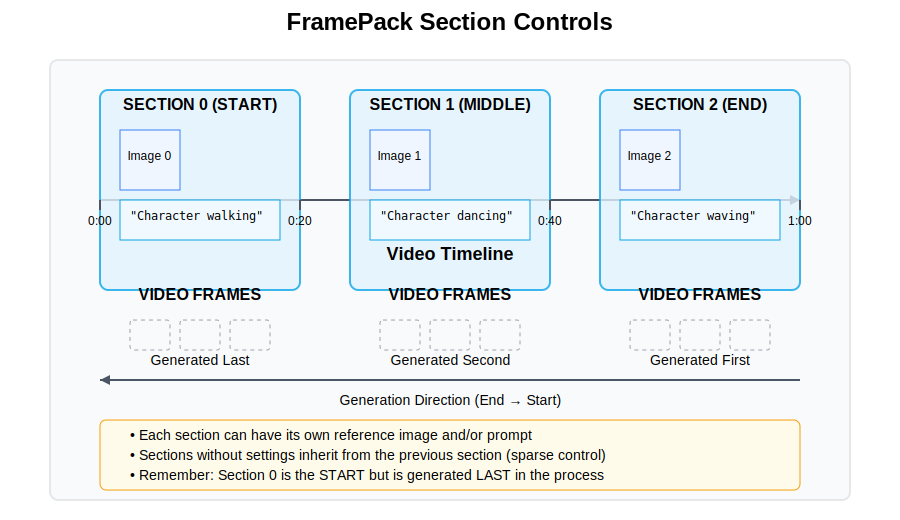

<p align="center">
    
</p>

# FramePack

An enhanced implementation of ["Packing Input Frame Context in Next-Frame Prediction Models for Video Generation"](https://lllyasviel.github.io/frame_pack_gitpage/), optimized for cloud deployment and with extended controls for precise video generation.

Links: [**Paper**](https://lllyasviel.github.io/frame_pack_gitpage/pack.pdf), [**Project Page**](https://lllyasviel.github.io/frame_pack_gitpage/)

## Core Innovations

FramePack uses a next-frame prediction approach that generates videos progressively:

- **Constant Memory Usage**: Compresses input contexts to a fixed size, making VRAM usage invariant to video length
- **Progressive Generation**: Create minute-long videos even on laptop GPUs (minimum 6GB VRAM)
- **Immediate Visual Feedback**: See frames as they're generated rather than waiting for the entire video
- **Section Controls**: Precisely control different segments of your video with custom prompts and reference images

## Key Enhancements in This Fork

This fork extends the original FramePack with several major improvements:

### 1. Cloud Deployment Support
- **RunPod Integration**: Fully optimized deployment to RunPod with a comprehensive deployment guide
- **Secure SSH Access**: Enhanced security through SSH port forwarding without exposing endpoints

### 2. Advanced Section Controls
- **Multi-Section Video Generation**: Define different prompts and reference images for each section of your video
- **Progressive Transition System**: Seamless transitions between different video segments
- **Intuitive UI**: User-friendly interface for defining section settings with visual feedback

### 3. Enhanced UI and User Experience
- **Improved Parameter Organization**: Better organized settings with logical grouping
- **Parameter Persistence**: Save your favorite settings for future use
- **Performance Optimizations**: Options for TeaCache, FP8 quantization, and memory management
- **LoRA Support**: Easily apply LoRA models to customize generation style

### 4. Output Quality Improvements
- **End Frame Control**: Define both start and end frames for your video
- **Camera Movement Controls**: Adjust the level of camera motion in your generations
- **Video Compression Settings**: Fine-tune output quality with customizable compression

## Requirements

Requirements:

* Nvidia GPU in RTX 30XX, 40XX, 50XX series that supports fp16 and bf16. The GTX 10XX/20XX are not tested.
* Linux or Windows operating system.
* At least 6GB GPU memory.

To generate 1-minute video (60 seconds) at 30fps (1800 frames) using 13B model, the minimal required GPU memory is 6GB. (Yes 6 GB, not a typo. Laptop GPUs are okay.)

## Installation

**Windows**:

Installing on Windows requires a few extra steps, especially for SageAttention:

1. **Basic Installation**:
   
   We recommend having an independent Python 3.11 installation.

   ```
   pip install torch torchvision torchaudio --index-url https://download.pytorch.org/whl/cu126
   pip install -r requirements.txt
   ```

2. **Installing SageAttention on Windows**:

   SageAttention requires Triton, which traditionally has been challenging to install on Windows. There are two options for installing SageAttention:

   **SageAttention 2.1.1**
   
   a. **Install Triton for Windows**:
      - Use the Windows-compatible fork of Triton:
      ```
      pip install https://github.com/woct0rdho/triton-windows/releases/download/v3.2.0-windows.post10/triton-3.2.0-cp311-cp311-win_amd64.whl
      ```
      (Choose the correct wheel for your Python version)

   b. **Install SageAttention 2.1.1**:
      - Once Triton is installed, you can install SageAttention:
      - For Python 3.11 with PyTorch 2.6.0 (CUDA 12.6), you can directly install the prebuilt wheel:
      ```
      pip install https://github.com/woct0rdho/SageAttention/releases/download/v2.1.1-windows/sageattention-2.1.1+cu126torch2.6.0-cp311-cp311-win_amd64.whl
      ```
         
3. **Starting the Application**:

   ```
   python app.py
   ```

   Note that it supports `--share`, `--port`, `--server`, and so on.

The software now prioritizes SageAttention when available, falling back to PyTorch native attention when not available. This optimization improves performance while maintaining quality.

**Linux**:

We recommend having an independent Python 3.11.

    pip install torch torchvision torchaudio --index-url https://download.pytorch.org/whl/cu126
    pip install -r requirements.txt

To start the GUI, run:

    python app.py

Note that it supports `--share`, `--port`, `--server`, and so on.

You can install attention kernels for improved performance:

- **SageAttention 2.1.1**:
  For Linux with PyTorch 2.6.0, check the latest builds at:
  https://github.com/thuml/SageAttention/releases

## Cloud Deployment

For deploying to cloud platforms like RunPod, refer to the [RunPod Deployment Guide](RUNPOD_DEPLOYMENT_GUIDE.md) which provides step-by-step instructions for:

1. Setting up a secure RunPod environment
2. Configuring SSH for secure access
3. Using port forwarding for private access to the application
4. Managing workspace directories and caching

## Understanding Section Controls

The section controls feature allows for precise control over different segments of your generated video:



### How Section Controls Work

1. **Reverse Index Mapping**: Since FramePack generates videos in reverse (end → start), the section numbering is mapped accordingly:
   - UI Section 0: Start of video (Generated Last)
   - UI Section 1: Middle of video (Generated Second)
   - UI Section 2: End of video (Generated First)

2. **Section-Specific Prompts**: Each section can have its own prompt that guides that segment's generation
   - Valid keys for each section are mapped based on the generation order
   - Prompts cascade forward - if a section has no specific prompt, it uses the previous section's

3. **Section-Specific Images**: Each section can have a distinct reference image
   - Similar to prompts, images cascade forward through sections
   - This allows for visual transitions between different scenes or subjects

4. **Progressive Generation**: The system generates sections from the end of the video toward the beginning
   - Each new section uses the growing history buffer of previously generated frames
   - This ensures temporal consistency while allowing creative direction changes

## Tips for Best Results

1. **Start with TeaCache On**: Use TeaCache for faster iterations while exploring ideas
2. **Final Renders**: Disable TeaCache for your final high-quality renders
3. **Section Controls**: Remember that section 0 appears at the **start** of the video, but is generated **last**
4. **Smooth Transitions**: For smoother transitions, use similar prompts or images between adjacent sections
5. **Memory Management**: Adjust GPU memory preservation if you encounter out-of-memory errors
6. **Start Simple**: Begin with shorter videos to understand the system before generating minute-long content

## Examples

Many more examples are in [**Project Page**](https://lllyasviel.github.io/frame_pack_gitpage/).